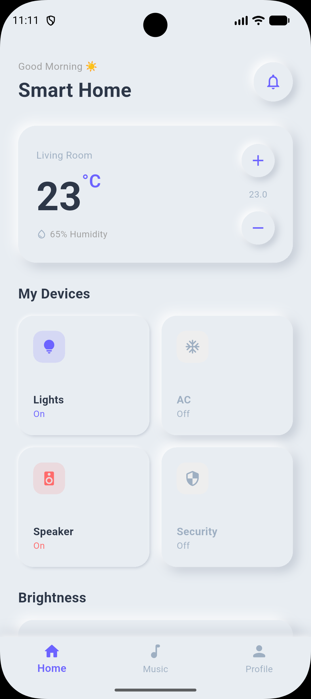
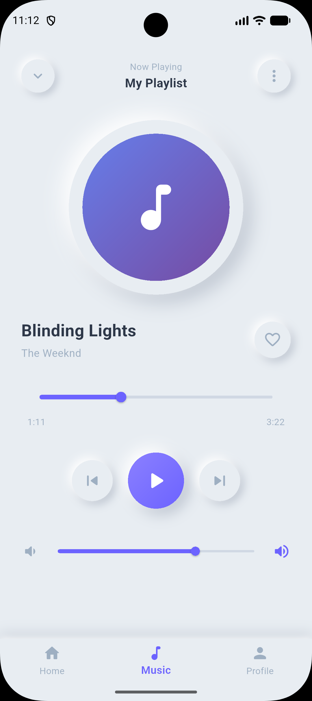

# Flutter Neumorphism UI

[](https://pub.dev/publishers/sanjaysharmajw.com)
[](https://pub.dev/packages/flutter_neumorphism_ui)
[](https://pub.dev/packages/flutter_neumorphism_ui/score)
[](https://pub.dev/packages/flutter_neumorphism_ui)
[](https://pub.dev/packages/flutter_neumorphism_ui)

A Flutter package for building beautiful **Neumorphic** (soft-UI) interfaces with minimal code. It provides a clean, simple API with smart shadow auto-computation — no need to manually specify shadow colors every time.

---

## Screenshots

<table>
  <tr>
    <td align="center"><b>Smart Home</b></td>
    <td align="center"><b>Music Player</b></td>
  </tr>
  <tr>
    <td></td>
    <td></td>
  </tr>
</table>

---

## Features

- **`FlutterNeumorphism`** — new simple widget, just pass a child and an optional `NeumorphismStyle`
- **`NeumorphismStyle`** — bundles all styling; auto-computes light/dark shadows from the base color
- **`NeumorphismType.flat`** — raised / embossed look
- **`NeumorphismType.pressed`** — inset / debossed look (great for active/toggle states)
- **`BoxShape.circle`** support — circular neumorphic buttons and avatars
- Optional `onTap` — add interaction only when needed
- Auto-sized containers — `width` and `height` are optional; widget sizes to content
- Fully backward-compatible with the original `FlutterNeumorphisms` widget

---

## Installation

Add to your `pubspec.yaml`:

```yaml
dependencies:
  flutter_neumorphism_ui: ^1.0.2
```

Then import:

```dart
import 'package:flutter_neumorphism_ui/flutter_neumorphism_ui.dart';
```

---

## Quick Start

### Minimal example (auto shadows, sizes to content)

```dart
FlutterNeumorphism(
  child: Text('Hello Neumorphism'),
)
```

### Card

```dart
FlutterNeumorphism(
  style: NeumorphismStyle(
    color: Color(0xFFE8EDF2),
    borderRadius: 20,
    depth: 8,
  ),
  padding: EdgeInsets.all(20),
  child: Text('Card'),
)
```

### Circular button

```dart
FlutterNeumorphism(
  style: NeumorphismStyle(
    color: Color(0xFFE8EDF2),
    shape: BoxShape.circle,
    depth: 8,
  ),
  width: 60,
  height: 60,
  padding: EdgeInsets.zero,
  onTap: () {},
  child: Icon(Icons.play_arrow_rounded),
)
```

### Pressed / active state (toggle)

```dart
FlutterNeumorphism(
  style: NeumorphismStyle(
    color: Color(0xFFE8EDF2),
    depth: isActive ? 3 : 8,
    type: isActive ? NeumorphismType.pressed : NeumorphismType.flat,
  ),
  onTap: () => setState(() => isActive = !isActive),
  child: Icon(Icons.lightbulb_rounded),
)
```

### Custom shadow colors

```dart
FlutterNeumorphism(
  style: NeumorphismStyle(
    color: Color(0xFFE8EDF2),
    lightShadow: Colors.white,
    darkShadow: Color(0xFFB8C0CC),
    depth: 10,
    borderRadius: 24,
  ),
  child: Text('Custom shadows'),
)
```

---

## `NeumorphismStyle` Parameters

| Parameter | Type | Default | Description |
|-----------|------|---------|-------------|
| `color` | `Color` | `Color(0xFFE8EDF2)` | Background color of the neumorphic surface |
| `borderRadius` | `double` | `16.0` | Corner radius (ignored when `shape` is circle) |
| `depth` | `double` | `8.0` | Shadow intensity — controls offset & blur. Range: 0–20 |
| `type` | `NeumorphismType` | `flat` | `flat` (raised) or `pressed` (inset) |
| `shape` | `BoxShape` | `rectangle` | `rectangle` or `circle` |
| `lightShadow` | `Color?` | auto | Highlight shadow. Auto-computed from `color` if omitted |
| `darkShadow` | `Color?` | auto | Dark shadow. Auto-computed from `color` if omitted |

---

## `FlutterNeumorphism` Parameters

| Parameter | Type | Required | Description |
|-----------|------|----------|-------------|
| `child` | `Widget` | ✅ | The widget inside the neumorphic surface |
| `style` | `NeumorphismStyle` | — | Styling. Defaults to `NeumorphismStyle()` |
| `onTap` | `VoidCallback?` | — | Tap callback. Omit for non-interactive widgets |
| `width` | `double?` | — | Fixed width. Omit to size to content |
| `height` | `double?` | — | Fixed height. Omit to size to content |
| `padding` | `EdgeInsets?` | — | Inner padding. Defaults to `EdgeInsets.all(16)` |
| `margin` | `EdgeInsets?` | — | Outer margin |

---

## Example App

The example app includes three fully interactive screens:

- **Home** — Smart Home dashboard with device toggles, temperature control, brightness slider, and scene selector
- **Music** — Music player with track switching, play/pause, progress & volume sliders, and favorite toggle
- **Profile** — User profile with stats cards and settings menu

All built exclusively with `FlutterNeumorphism` and `NeumorphismStyle`.

---

## Legacy API

The original `FlutterNeumorphisms` widget is still available and unchanged for backward compatibility:

```dart
FlutterNeumorphisms(
  onTap: () {},
  backgroundColor: Colors.grey.shade300,
  topLeftShadowColor: Colors.white,
  bottomRightShadowColor: Colors.grey.shade500,
  topLeftShadowBlurRadius: 15,
  bottomRightShadowBlurRadius: 15,
  topLeftShadowSpreadRadius: 1,
  bottomRightShadowSpreadRadius: 1,
  topLeftOffset: const Offset(-4, -4),
  bottomRightOffset: const Offset(4, 4),
  borderRadius: 12,
  borderWidth: 0,
  height: 100,
  width: double.infinity,
  child: Row(
    children: [
      Icon(Icons.opacity_rounded, size: 30),
      SizedBox(width: 20),
      Column(
        crossAxisAlignment: CrossAxisAlignment.start,
        children: [
          Text('Drop', style: TextStyle(fontSize: 20)),
          Text('Neumorphism', style: TextStyle(fontSize: 18)),
        ],
      ),
    ],
  ),
)
```

---

## License

MIT License. See [LICENSE](LICENSE) for details.
